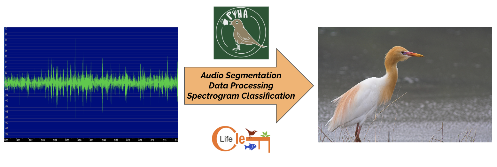
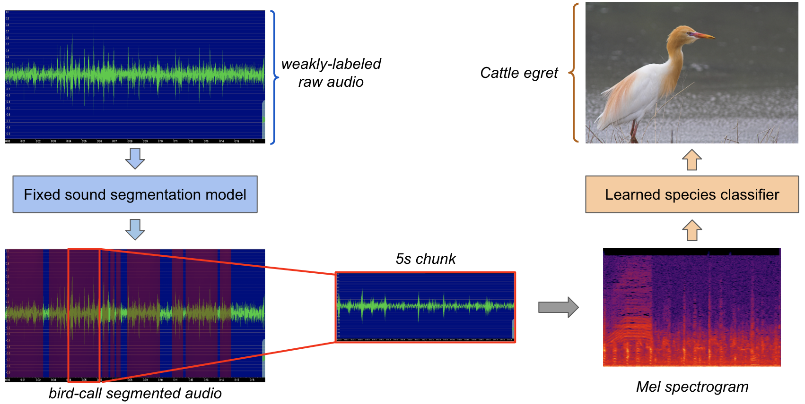

# Acoustic Multiclass Identification



## Contents
- [Project Overview](#project-overview)
- [Installation](#installation)
- [Data Setup](#data-setup)
- [Data Processing](#data-processing)
- [Classification](#classification)
    - [Logging](#logging)

## Project Overview

Passive acoustic monitoring (PAM) plays a crucial role in conservation efforts and the preservation of biodiversity. By capturing and analyzing the sounds produced by avian species in their natural habitats, this non-invasive method provides valuable insights into population dynamics, species richness, and habitat quality, as birds may act as key indicators of larger environmental effects. However, as PAM systems may collect terabytes of noisy audio data, with other species and human encroachment polluting the recordings, extracting useful information from such audio recordings (i.e. where are birds present in the recording, what species of birds are they, etc.) remains an open problem. 

This repo attempts to address this issue as part of the Automated Acoustic Species Identification pipeline in UCSD [Engineers for Exploration](https://e3e.ucsd.edu/). We created a uniform pipeline for preprocessing, training, and testing neural networks that aim to identify a significant number of species in a given environment. The full pipeline takes [Xeno-Canto](https://xeno-canto.org/) data as input, runs our Weak to Strong label pipeline [PyHa](https://github.com/UCSD-E4E/PyHa) over file-level labels to produce time-specific, strongly labeled annotations that can be passed into our training methods. From here, acoustic bird species classifiers can be trained and tested to determine their ability to detect species of interest in any given region.

This work was initially started during the [BirdCLEF2022 Kaggle Competition](https://www.kaggle.com/competitions/birdclef-2023). Large credits to CSE 145 and 237d teams who assisted with this project and the summer 2023 REU students at E4E. 



Our main pipeline (shown above) can be described as follows:

1. For a given set of weakly-labeled noisy audio recordings (i.e. the entire recording may have a label for a bird species, but no information about where in the recording the call is), we use [PyHa](https://github.com/UCSD-E4E/PyHa) to extract 5s segment mel-spectrograms of the original audio, where each 5s segment is estimated to include the bird call matching the given label.
2. We use this strongly labeled mel-spectra data to train a bird species classifier (as well as an optional bird detector), which at inference time is given an unlabeled 5s audio clip and predicts which species are present in the audio.


A detailed description of the project and producing it is shown below.

## Installation

We recommend that you use Miniconda for all package management. Once Miniconda is downloaded (see [here](https://conda.io/projects/conda/en/latest/user-guide/install/index.html) for information on Miniconda installation), run the following command to setup the conda environment for the repo:

```bash
conda env create -f environment.yml
```

To recreate our results, [PyHa](https://github.com/UCSD-E3E/PyHa) needs to be installed and set up. Furthermore, our results are based on the [BirdCLEF2023 dataset](https://www.kaggle.com/competitions/birdclef-2023). You may also find it useful to use a  [no-call dataset](https://www.kaggle.com/code/sprestrelski/birdclef23-uniform-no-call-sound-chunks) compiled from previous competitions.


## Data Setup
The data processing pipeline assumes a folder directory structure as follows
```
data
├── XC113913.wav
├── XC208240.wav
└── XC324913.wav
├── XC126499.wav
└── XC294062.wav
└── ...
```

The data folder, cache folder (optional), and CSV location must all be referenced in `config.py` before running `train.py`. In the CSV file, the `"FILE NAME"` column must be the name of the file with no path preceding it. In this example, it would be `XC113913.wav`.

The CSV file referenced in `config.py` contains all metadata about clips in that dataset, which includes song file location, offset and duration of the clip, and species name. Using multiple different CSV files allows for different training scenarios such as using a small subset of clips to test a data augmentation technique.

We ran into issues running PyHa over `.ogg` files, so there is an included function in `gen_csv_labels.py` to convert `.ogg` to `.wav` files and can be swapped out for your original file type. This is an issue for the data processing pipeline. However, the training pipeline can accept most file types. This will be fixed in future versions of PyHa.

## Data Processing
To process data using TweetyNet, you will need to have [PyHa](https://github.com/UCSD-E3E/PyHa) installed and set up.  

The main file is is `gen_csv_labels.py` and uses functions from `config.py` and `sliding_chunks.py`. After downloading and setting up PyHa, copy all scripts in the `chunking_methods/` folder into the PyHa directory and `cd` into it. Activate the PyHa conda environment and run the script by doing the following:
```
conda env create --file conda_environments/{filename}
conda activate species-id
```
If PyHa was correctly set up, running `gen_csv_labels.py` will generate two csvs: one with strong labels, one with chunked strong labels. For example, to create labels with 5 second, sliding window chunks for `.ogg` files in a folder called `~/amabaw1`, you can run the following:
```
python gen_csv_labels.py -l 5 -f .ogg -w -a ~/amabaw1  
```
If using simple chunks, ie. if the `sliding_window` is not used, it will only create one `.csv` for `chunk_labels`.

## Classification
The main file is `train.py`, which has the main training loop and uses functions from `dataset.py` and `model.py`. This has several hyperparameters related to training, logging, and data augmentation that can be passed in as arguments. For example, to run with a mixup probability of -1.6, with all other arguments kept to the defaults, you would run:

```py
python train.py –mix_p=-1.6
```

These hyperparameters can also be changed in `config.py`. It's currently required to run this script from within the repo directory to save the Git hash in the config namespace. This assists with reproducibility by saving the hash used to run the model. 

To select a model, change the `model_name` parameter in `config.py` when instantiating `timmsModels`, or edit the `model.py` file directly. `model.py` loads in models using the [Pytorch Image Models library (timm)](https://timm.fast.ai/) and supports a variety of models including EfficientNets, ResNets, and DenseNets. To directly load local models, you would add another parameter for the checkpoint path:
```py
self.model = timm.create_model('tf_efficientnet_b0', checkpoint_path='./models/tf_efficientnet_b1_aa-ea7a6ee0.pth')
```

Custom models will also be in the pipeline sometime in the future

### Logging
This project is set up with [WandB](https://wandb.ai), a dashboard to keep track of hyperparameters and system metrics. You’ll need to make an account and log in locally to use it. WandB is extremely helpful for comparing models live and visualizing the training process.


If you do not want to enable WandB logging, it can disabled during runtime using the `-l` flag:
```
python train.py -l False
```

## Inference 
The `inference.ipynb` notebook can be directly uploaded to and run on Kaggle. In the import section, the notebook takes in a local path to a pretrained checkpoint (can be replaced with a `timm` fetched model) with the model architecture and to the final model. Replicate any changes you made to the BirdCLEFModel class, or directly import from `train.py` if running on a local machine.

Under the inference section, modify the `pd.read_csv` line to your training metadata file. This is used to get a list of labels to predict. Also, change the `filepaths` variable to where your test data is stored. The given notebook removes two classes from the predictions, as there was no training data actually used (chunks were not able to generate), but these can be removed. The final output is `submission.csv`, which outputs probabilistic predictions for each class for every 5 second chunk of the training data.

